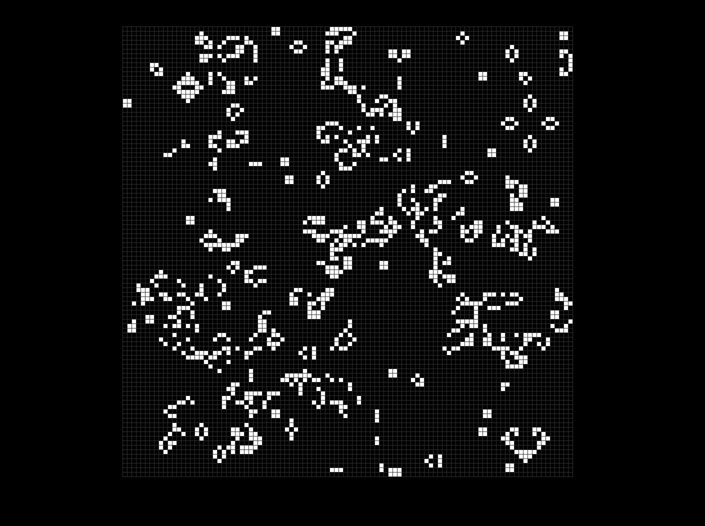

# Game of Life




## Description
The Game of Life is a zero-player simulation created by mathematician John Conway in 1970. It models how a grid of cells evolves over time based on simple survival rules.
Despite its simplicity, it can produce surprisingly complex patterns and is widely used in computer science to illustrate cellular automata.
This project is a C implementation using SDL2 for rendering.

## Installation
### Prerequisites:
This project requires the following dependencies:
- **SDL2**: Simple DirectMedia Layer 2 (SDL2) and SDL2_tf libraries for graphics rendering and font handling.
- **GCC**: The GNU C Compiler (or similar) to build the project.

### Install dependencies:
On **Ubuntu** or **Debian-based** systems, you can install the required libraries and project using the following commands:

```bash
sudo apt update
sudo apt install libsdl2-dev libsdl2-ttf-dev build-essential
git clone https://github.com/jojorequiem/game-of-life.git
cd game-of-life
make
./game_of_life
```


